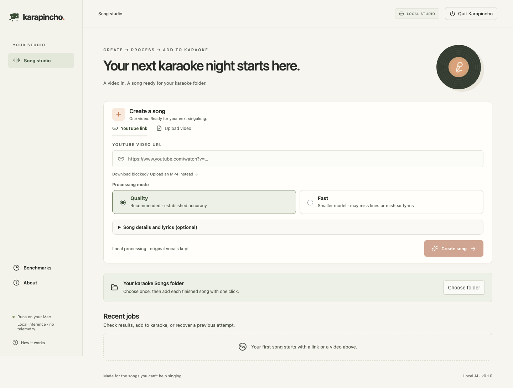
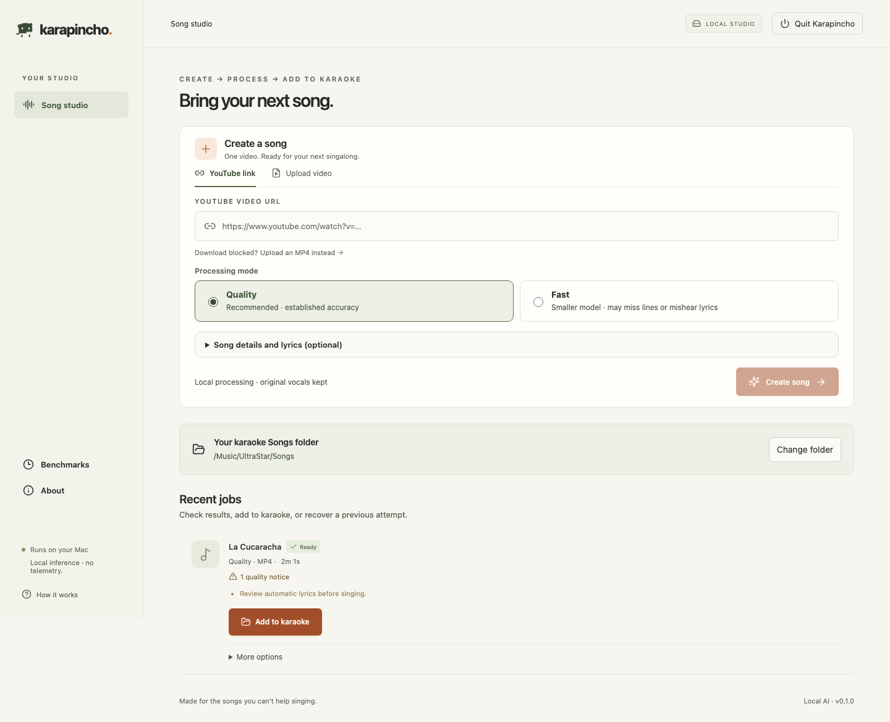

# Karapincho

<p align="center">
  
</p>

<p align="center"><strong>A local AI studio that turns a video into a ready-to-sing UltraStar song.</strong></p>

<p align="center">
  
  
  
</p>



Paste one public YouTube video URL or upload an MP4. Karapincho creates an UltraStar chart, original-vocal MP3, synchronized H.264 video, cover image, and ZIP. Processing and AI inference run locally on your Mac; no API key or subscription is required.

> **Beta software:** automatic lyrics, alignment, Japanese readings, and pitch detection are best-effort. Review quality notices before relying on an export.

## Requirements

- Apple Silicon Mac (M1 or newer); Intel Macs are unsupported.
- macOS 14 or newer.
- Python 3.12 and Node.js 22+. Setup can install them through Homebrew when available.
- At least 10 GB free for installation; 20 GB or more recommended for working files.
- Internet access for first setup, model downloads, YouTube input, and optional LRCLIB lookup.

MLX transcription is optional and requires a compatible macOS build. If unavailable, Karapincho automatically retains CPU transcription and can still use other supported acceleration.

## Quick start

1. Download the source archive and move the folder somewhere permanent.
2. Control-click **Setup.command**, choose **Open**, and let setup install dependencies, build the interface, and download approximately 7 GB of models.
3. Open **Start.command**. Karapincho opens at `http://127.0.0.1:8765`; keep its Terminal window open while processing.

Paste one public YouTube URL or select/drop an MP4. Keep **Quality** for the established transcription settings, or choose **Fast** for a smaller model that can be less accurate, then select **Create song**.

Karapincho keeps your Mac awake while processing songs, including queued songs and lyric rebuilds. The screen can turn off and you can use other apps. Normal idle sleep resumes when processing finishes. Keep a MacBook's lid open and leave Karapincho's Terminal window running; closing the lid or choosing **Sleep** can still pause processing.

Choose your karaoke **Songs** folder once. When processing finishes, review quality notices and select **Add to karaoke**. Karapincho copies the complete song directly into that folder. Existing names offer **Keep both** or explicit replacement; an export failure keeps your completed local song available for retry. ZIP download and lyric correction remain under **More options**.

Recent jobs are a processing history, not a second karaoke library. **Clean up…** shows reclaimable disk space and removes local working and rebuild files after confirmation. Copies in your karaoke folder and export history are kept. Reprocessing after cleanup requires the original source again. Use **Quit Karapincho** before moving Karapincho’s folder or deleting local data.



If Finder will not run a launcher, open Terminal in the Karapincho folder and run `./Setup.command` or `./Start.command`. See [Troubleshooting](docs/TROUBLESHOOTING.md) for common failures.

## Output

```text
Artist - Song/
  song.txt
  audio.mp3
  video.mp4
  cover.jpg
```

The MP3 keeps the original vocals. Separation is used only for analysis. Spanish and English remain in their original language; Japanese is aligned in its original script and exported as ASCII Hepburn romaji. Exports target the classic UltraStar format used by UltraStar Deluxe and WorldParty.

Inputs are limited to one song, 20 minutes, and 2 GB. YouTube may reject downloads because of access restrictions or anti-bot checks; Karapincho never asks for browser cookies or login. Use an MP4 instead.

## Privacy and responsible use

Karapincho contains no accounts, analytics, advertising, crash reporter, or telemetry.

| Activity | Network behavior |
|---|---|
| MP4 upload and AI processing | Remains on your Mac |
| YouTube input | Contacts YouTube to download public media and metadata |
| Automatic lyric lookup | Sends title, artist, album when known, and duration to LRCLIB; never sends audio |
| Setup | Downloads dependencies and model weights from their upstream hosts |

Only download and process recordings you are entitled to use. Karapincho is not affiliated with or endorsed by YouTube, LRCLIB, UltraStar Deluxe, or UltraStar WorldParty. Read the full [privacy and network notes](docs/PRIVACY.md).

## Why “Karapincho”?

Karapincho combines **karaoke** with **carpincho**—the Spanish word for capybara. The capybara is the app’s calm studio companion: you bring the song, and it handles the busy work.

The existing capybara mark is Karapincho’s canonical logo.

## AI-assisted development

Karapincho was created by Gonzalo Cibeira with substantial assistance from AI tools, including support with product design, implementation, testing, research, and documentation. Gonzalo directed the project and remains its maintainer.

AI assistance does not replace review: release claims are backed by automated tests, reproducible fixtures, and the checks described in [VALIDATION.md](VALIDATION.md).

## Documentation

- [Architecture, pipeline, and API](docs/ARCHITECTURE.md)
- [Benchmarks](docs/BENCHMARKS.md)
- [Troubleshooting](docs/TROUBLESHOOTING.md)
- [Privacy and network activity](docs/PRIVACY.md)
- [References and acknowledgements](docs/REFERENCES.md)
- [Third-party notices](THIRD_PARTY_NOTICES.md)
- [Validation evidence and limitations](VALIDATION.md)
- [v0.1.0 release notes](docs/RELEASE_NOTES_v0.1.0.md)
- [Creation workflow validation and remaining release gates](docs/WORKFLOW_VALIDATION.md)

## Development

```bash
python3.12 -m venv .venv
.venv/bin/python -m pip install -r requirements-macos.lock
.venv/bin/python -m pip install -e '.[dev,ai]'
npm ci --prefix frontend
npm run build --prefix frontend
.venv/bin/python -m pytest -q
.venv/bin/python -m ruff check karapincho tests scripts
.venv/bin/python -m pip check
```

Run the backend with:

```bash
.venv/bin/python -m uvicorn karapincho.app:app --host 127.0.0.1 --port 8765
```

For frontend development, use `npm run dev --prefix frontend`; it proxies `/api` to the local backend. Do not bind Karapincho to a public interface.

The project does not currently promise support or review unsolicited contributions. Forks and redistribution remain welcome under the GPL. See [SUPPORT.md](SUPPORT.md) and report security issues through GitHub’s private vulnerability-reporting channel.

## License

Karapincho's source code is free software licensed under the [GNU General Public License v3.0 or later](LICENSE) (`GPL-3.0-or-later`). You may use the code personally or commercially, study and modify it, and redistribute it under the GPL’s terms. It is provided without warranty.

Bundled benchmark recordings, downloaded model weights, and other third-party components retain their own licenses; see [THIRD_PARTY_NOTICES.md](THIRD_PARTY_NOTICES.md). In particular, upstream does not grant commercial-use rights for the default Demucs pretrained weight; commercial users must substitute appropriately licensed separation weights.
